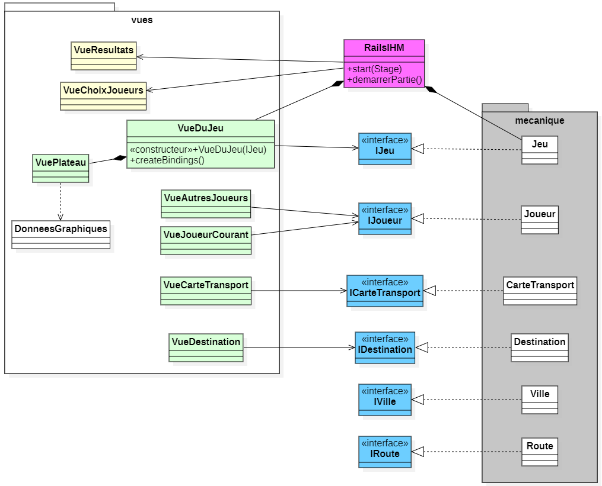

# Projet _Aventuriers du Rail (Autour du Monde) -- IHM_

### IUT Montpellier-Sète – Département Informatique

Ce projet est la suite de la [Phase 1 du projet _Aventuriers du Rail Autour du Monde_](https://gitlabinfo.iutmontp.univ-montp2.fr/dev-objets/projets/aventuriers-monde) dans le cadre des Situations d'Apprentissage et Évaluation du BUT Informatique (SAE S2.01). Le code de cette dernière phase est totalement indépendant de la [Phase 2](https://gitlabinfo.iutmontp.univ-montp2.fr/graphes/aventuriers-du-graphe). 

Dans cette phase du projet, vous allez programmer une interface graphique en _JavaFX_ pour la mécanique du jeu _Aventuriers du Rail (Autour du Monde)_. La mécanique, vous l'avez déjà programmée durant la [**Phase 1**](https://gitlabinfo.iutmontp.univ-montp2.fr/dev-objets/aventuriers-du-rail). Cependant, le code encapsulant la mécanique du jeu qui vous est distribué pour cette dernière phase est différent, car il a été adaptée pour _JavaFX_.

## Organisation du travail

* **Phase 3 : _implémentation d'une interface graphique sous [JavaFX](https://openjfx.io/)_**
    * **Cours concerné** : _Développement d’applications avec IHM_
    * [**Support de cours**](https://gitlabinfo.iutmontp.univ-montp2.fr/ihm/ressources)

* **Enseignants :** [Sophie Nabitz](mailto:sophie.nabitz@univ-avignon.fr),
      [Cyrille Nadal](mailto:cyrille.nadal@umontpellier.fr),
      [Nathalie Palleja](mailto:nathalie.palleja@umontpellier.fr),
      [Xavier Palleja](mailto:xavier.palleja@umontpellier.fr),
      [Petru Valicov](mailto:petru.valicov@umontpellier.fr)
  
* **Période de réalisation :** 22 mai - 9 juin 2023 à 23h

**Pour des questions :**
* Le [forum Piazza](https://piazza.com/class/lfmbartihpv60i) - à privilégier lorsque vous avez des questions sur le projet.
* [Email](mailto:petru.valicov@umontpellier.fr) pour une question d'ordre privée concernant le projet.

## Consignes générales
Un squelette du code vous est fourni et vous devrez :
  * Écrire les classes qui vous sont décrites, en ajoutant les fonctions et attributs qui vous semblent utiles.
  * Vérifier que votre interface graphique réagit comme attendu. Des tests unitaires de cette interface ne sont pas demandés.
  * Sauf indication explicite de la part des enseignants, ne pas modifier les méthodes et classes de la logique du jeu qui vous sont données.

Des consignes détaillées du projet vous sont données dans le fichier [Consignes.md](Consignes.md). _**Le non-respect de ces consignes impliquera une pénalité de plusieurs points sur la note finale du projet.**_

## Présentation
Vous connaissez déjà les règles, mais si besoin, vous pouvez les retrouver dans le repertoire `documents`.

Vous partirez d'une version du moteur déjà implémentée (la logique de l'application), qu'a priori, vous ne devez pas modifier. Cette partie est différente de la correction de la [Phase 1](https://gitlabinfo.iutmontp.univ-montp2.fr/dev-objets/aventuriers-du-rail) du projet, elle a été adaptée pour réagir aux événements sur l'interface graphique. Vous considèrerez cette partie comme totalement encapsulée, non invocable directement, et vous la ferez exécuter en utilisant des interfaces _Java_ jouant un rôle de [façades](https://fr.wikipedia.org/wiki/Fa%C3%A7ade_(patron_de_conception)), permettant de communiquer avec la logique interne. Les méthodes de ces interfaces sont sommairement commentées, vous devez vous y référer (en complément du présent document) afin d'identifier laquelle utiliser dans quelle situation.

Vous allez implémenter plusieurs classes (certaines méthodes vous sont suggérées), dans lesquelles vous allez ajouter tout ce qui sera utile à votre IHM.

## Architecture générale du code
Voici le diagramme de classes simplifié de l'application :

Pensez à le consulter en détails pour mieux vous situer.

Ce diagramme ne détaille pas les classes et relations de la partie mécanique du jeu, ni ne liste les méthodes des classes que vous utiliserez. Pour ne pas surcharger le diagramme, les attributs et les fonctions ne sont pas présentés. **Vous y voyez surtout les classes qui sont nécessaires à votre travail.**

### Le paquetage `mecanique`

Ce paquetage, en gris sur le diagramme, représente la logique interne du jeu. **Vous n'avez pas besoin d'en lire le code**. Il contient beaucoup plus de classes que celles présentées ci-dessus, elles ne vous seront pas utiles pour comprendre ce qui est à faire. Les 6 classes de ce paquetage illustrées sur le diagramme seront utilisées indirectement dans votre code. Vous y accédez en utilisant les interfaces en bleu, dont le nom (qui commence par un `I` majuscule) correspond aux classes d'implémentation. En lisant ces interfaces "façades", vous verrez que de nombreuses propriétés sont exposées à travers des méthodes. Vous devez les utiliser, dans vos vues (paquetage `vues`), pour définir vos écouteurs d'événements et de changements qui mettront à jour votre IHM. A priori, dans ces interfaces, il y a suffisamment de propriétés exposées pour que vous puissiez réaliser votre IHM, donc vous n'avez pas à les modifier.

### Le paquetage `vues`

Pour cette phase du projet, la partie qui vous intéresse se trouve dans ce paquetage. Il contient les classes d'IHM à implémenter, indiquées en vert sur le diagramme. Dans la suite de ce document, ces classes seront désignées par `VueXXX`. D'autres classes (en jaune sur le diagramme) peuvent être implémentées une fois que vous aurez terminé celles en vert. Voir plus bas pour des explications complémentaires.

#### Description sommaire des différentes vues
- La classe `VueDuJeu`, première vue de l'application, présente la vue générale de l'interface graphique. Celle qui vous est donnée ne fait qu'afficher le plateau du jeu. Vous allez donc la transformer pour intégrer d'autres éléments, correspondant aux classes décrites ci-dessous.
- La classe `VueDuJoueurCourant` présente les éléments appartenant au joueur courant, actualisés à chaque changement de joueur.
- La classe `VueAutresJoueurs` présente les éléments des joueurs autres que le joueur courant, en cachant ceux que le joueur courant n'a pas à connaitre.
- La classe `VuePlateau` présente les routes et les villes sur le plateau, avec lesquelles le joueur pourra interagir afin de jouer son action.
- La classe `VueCarteTransport` représente la vue d'une unique carte Wagon et la classe `VueDestination` représente la vue d'une unique carte Destination.
- La classe `VueChoixJoueurs`, qui peut éventuellement être affichée en début de partie, permet de choisir le nombre et les noms des joueurs de la partie.
- La classe `VueResultats` est affichée en fin de partie, elle affiche les scores de chacun des joueurs et peut éventuellement proposer de rejouer.
 
En consultant le code de ces classes, vous prendrez connaissance des éléments essentiels à implémenter, **auxquels vous avez toute liberté d'ajouter ce qui vous convient**.

### Organisation interne de l'application
La classe `RailsIHM` (en rose sur le diagramme de classes) vous est fournie. Elle représente l'`Application` JavaFX et effectue essentiellement plusieurs tâches :
- Elle crée une partie (objet de type `Jeu`), qui gère la logique interne du jeu et qui s'exécute en réponse aux événements sur l'interface graphique.
- Elle crée la scène en la construisant avec la première vue, qui est un objet de type `VueDuJeu`.
- Par défaut, elle crée une partie à 4 joueurs. Si souhaité, vous pourrez faire en sorte qu'elle démarre l'interface graphique sur une fenêtre permettant de saisir le nombre et les noms des joueurs de la partie. Pour cela, quelques modifications de votre part seront nécessaires (voir le [paragraphe correspondant](#ajout-dune-fenêtre-initiale-pour-le-choix-des-joueurs) plus loin).

La classe `RailsIHM` est suffisamment complète et ne nécessite aucune modification de votre part pour faire fonctionner votre programme (du moins dans l'immédiat).

### Organisation interne des interfaces d'accès à la logique du jeu
Dans les interfaces qui permettent d'accéder à la logique interne du jeu (en bleu sur le diagramme), vous constaterez que sont d'abord présentées les propriétés du jeu que vous pouvez écouter. Ensuite certains getters et enfin les méthodes que vous pouvez invoquer pour activer la logique interne.
A priori, les propriétés essentielles pour la mise en place de l'interface graphique sont exportées dans ces interfaces. Mais vous pouvez ajouter d'autres méthodes dans ces interfaces si vous en avez besoin. Pour cela voir le [paragraphe correspondant](#ajout-de-propriétés) plus loin.

## Quelques informations techniques
### Composant graphique et contrôleur
En lisant le constructeur de la classe `VuePlateau`, vous remarquez qu'elle charge le fichier `plateau.fxml` du répertoire `resources/fxml`, elle correspond donc au contrôleur de ce fichier _fxml_. Par ailleurs, vous pouvez voir que cette classe hérite de la classe [Pane](https://openjfx.io/javadoc/18/javafx.graphics/javafx/scene/layout/Pane.html) : par conséquent, elle est aussi un composant graphique en soi. Elle est à la fois le composant et le contrôleur de ce composant. On peut avoir recours à ce genre de technique lorsqu'on veut créer un composant graphique qu'on souhaite utiliser plusieurs fois, tel quel, dans d'autres composants parents quelconques.

Prenons un exemple : afin de laisser l'utilisateur choisir les destinations qui lui conviennent, on va présenter sur l'IHM plusieurs `VueDestination`, qu'il aura fallu instancier plusieurs fois. Si la représentation graphique d'une destination est décrite dans un fichier _fxml_, il faut charger ce fichier à chaque fois qu'on veut insérer le composant graphique. En utilisant cette technique du "composant graphique qui est son propre contrôleur", lorsqu'on instancie un objet de la classe `VueDestination`, on instancie aussi le contrôleur. De plus, dans tout autre fichier _fxml_ qui souhaite utiliser ce composant, on peut directement utiliser le nom de sa classe comme balise à l'endroit où l'insérer.

### La vue du plateau
La classe `VuePlateau` vous est en grande partie fournie : elle charge l'image de fond du plateau et place les éléments graphiques correspondant aux routes et aux ports.
Ces éléments graphiques, des rectangles et des cercles, sont construits à partir de données précalculées, fournies par la classe `DonneesGraphiques`. Cette dernière classe n'est, a priori, pas à modifier (sauf pour le pourcentage d'écran - voir le [paragraphe correspondant](#taille-de-la-scène) plus loin). Vous pouvez observer qu'elle se contente de fournir les éléments nécessaires à la construction des routes et des ports.

Dans le constructeur de `VuePlateau`, à chaque élément du plateau (cercle ou rectangle) est associé un gestionnaire d'événement de clic de souris, nommé `choixPort` ou `choixRoute`. Les méthodes des gestionnaires d'événement devront appeler `unPortAEteChoisi(String)` ou `uneRouteAEteChoisie(String)` du jeu, pour déclencher le traitement adéquat dans la logique du jeu. Chaque élément du plateau possède un identifiant (`String getId()`), qui permet de l'identifier dans le jeu.

### Accès au jeu
Dans votre code, pour déclencher les traitements du jeu à la suite des actions de l'utilisateur sur l'interface graphique, vous devez passer par l'interface `IJeu`. Par exemple, lorsque l'utilisateur choisit de passer, en cliquant sur un élément graphique qui correspond à "_Passer_", il faut appeler la méthode `passerAEteChoisi` de l'interface `IJeu`. La vue principale du jeu (`VueDuJeu`) est construite avec une référence sur le jeu. Par conséquent, si l'on souhaite accéder à cette référence `IJeu` depuis d'autres vues, alors on peut le faire à travers la scène de la vue principale (méthode `getScene()` définie pour tous les `Node`), et le cas échéant, à la racine de cette scène (`getRoot()` de la classe `Scene`).
 Ainsi, par exemple le code suivant `((VueDuJeu) getScene().getRoot()).getJeu()` permet d'accéder au jeu si la vue du jeu est la racine de la scène. Oui, il y a un [cast](https://docs.oracle.com/javase/specs/jls/se17/html/jls-5.html#jls-5.5), mais là, il est nécessaire ! :smirk:

### Utilisation de la classe [`Pane`](https://openjfx.io/javadoc/18/javafx.graphics/javafx/scene/layout/Pane.html)
Les vues qui sont proposées héritent actuellement de la classe [`Pane`](https://openjfx.io/javadoc/18/javafx.graphics/javafx/scene/layout/Pane.html). Vous allez probablement changer cette classe-mère afin d'utiliser un composant qui vous parait plus approprié.

Si toutefois vous préférez continuer à utiliser cette classe (le fait de conserver `Pane` en classe de base ne limite pas vos choix de conception de l'IHM), vous devez créer les composants graphiques et les ajouter à la liste des enfants avec `getChildren()` de `Pane`. Si vous choisissez un autre conteneur comme classe de base, `getChildren()` ne sera peut-être plus la méthode à utiliser...

### Taille de la scène
Elle s'adapte à la taille de l'écran. Vous pouvez modifier la donnée `DonneesGraphiques.pourcentageEcran` afin de choisir le pourcentage d'écran que vous souhaitez que votre vue principale occupe.
 Les bindings de redimensionnement du plateau, exécutés lorsque l'utilisateur redimensionne la fenêtre, vous sont fournis dans la classe `VuePlateau`, vous pouvez éventuellement vous en inspirer, si vous souhaitez aussi redimensionner certains de vos composants graphiques.

### Les instructions pour l'utilisateur
La propriété `instruction` qui est proposée dans l'interface `IJeu` représente l'information à transmettre à l'utilisateur pour qu'il puisse choisir sa prochaine action. Elle est automatiquement mise à jour dans la logique interne du jeu, et vous pouvez vous en servir dans votre interface pour afficher le message approprié.

### Les différentes phases du jeu
Selon comment vous concevez votre interface graphique, vous pourriez avoir besoin de savoir si le jeu est en phase de préparation ou en fin de partie. Deux propriétés booléennes `jeuEnPreparation` et `finDePartie` sont accessibles dans l'interface `IJeu`, qui peuvent éventuellement vous permettre d'adapter vos composants graphiques. Elles sont automatiquement actualisées en interne dans le jeu.

### Ajout d'une fenêtre initiale pour le choix des joueurs
Dans un second temps, lorsque votre vue du jeu sera finalisée, vous pourrez travailler sur une autre fenêtre de départ, qui permet de saisir le nombre et les noms des joueurs.
 L'application est actuellement organisée pour lancer la vue principale du jeu. Lorsque vous souhaitez lancer, au départ, cette autre fenêtre, il faudra changer la valeur du booléen `avecVueChoixJoueurs` déclaré comme attribut dans `RailsIHM`. Ceci aura pour effet de provoquer l'instanciation d'un objet de la classe `VueChoixJoueurs`. Quand la saisie des noms des joueurs est terminée, vous ferez en sorte que la mise à jour de la liste observable `nomsJoueurs` (qui est faite à la fin de la méthode `setListeDesNomsDeJoueurs()`) déclenche le listener `quandLesNomsJoueursSontDefinis` de `RailIHM`, qui démarre la partie.

### Ajout de propriétés
Pour ceux qui voudraient aller plus loin, si vous le jugez nécessaire, vous pouvez ajouter d'autres propriétés que celles proposées dans les interfaces, afin de les écouter pour actualiser votre interface graphique. Pour cela, vous pouvez transformer en propriétés certains attributs basiques des classes de la logique du jeu. Dans ce cas, vous n'oublierez pas de définir les 3 méthodes setter, getter et accès à la propriété. Le code interne peut alors être amené à changer : toute affectation de la propriété devra alors passer par la méthode `setValue(..)` et l'accès à la valeur de propriété par la méthode `getValue()`.

## Rendu attendu

L'intégralité du code source du projet doit résider dans le dépôt GitLab IHM associé à votre équipe de projet (ce dépôt sera créé dans votre compte GitLab).

## Évaluation

L'évaluation de votre code sera faite par l'équipe enseignante et une soutenance du projet aura lieu entre le 12 juin et le 14 juin (date et heure exactes à préciser). Deux aspects de vos projets seront évalués :
* l'implémentation en JavaFX des différents composants et des traitements associés (gestion des événements, propriétés/bindings, l'utilisation des contrôles et des conteneurs JavaFX)
* l'ergonomie de votre interface graphique

Contrairement aux deux premières phases de ce projet, il n'y aura pas de tests automatisés pour noter votre réalisation.

# Bon travail à tous !
